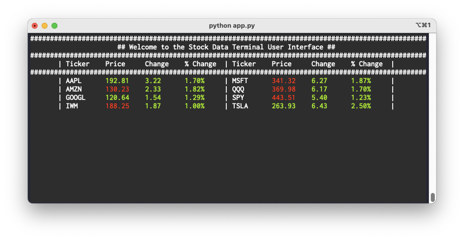

# Stock Price Terminal

This Python script fetches and displays real-time stock data for a list of ticker symbols. It uses the `yfinance` library to fetch the stock data and the `curses` library to display the data in a terminal user interface.

## Requirements
- Python 3.6+

## Dependencies

- yfinance
- shutil
- curses

## How to Run

1. Ensure that you have Python installed on your machine.
2. Install the required dependencies using pip:

```bash
pip install yfinance
```

3. Run the script:

```bash
python app.py
```

## Usage

The script displays real-time stock data for the following ticker symbols: 'AAPL', 'GOOGL', 'TSLA', 'AMZN', 'MSFT', 'SPY', 'QQQ', 'IWM'. 

The data includes the current price, price change, and percent change for each ticker symbol. The data is color-coded: green for price increases and red for price decreases.

To exit the script, press 'q'.

## Screenshot


